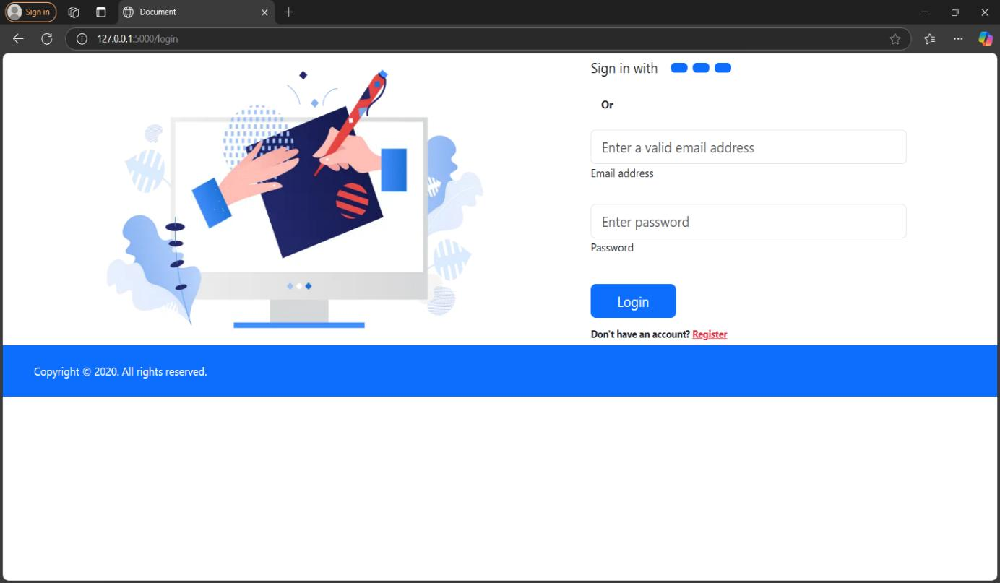
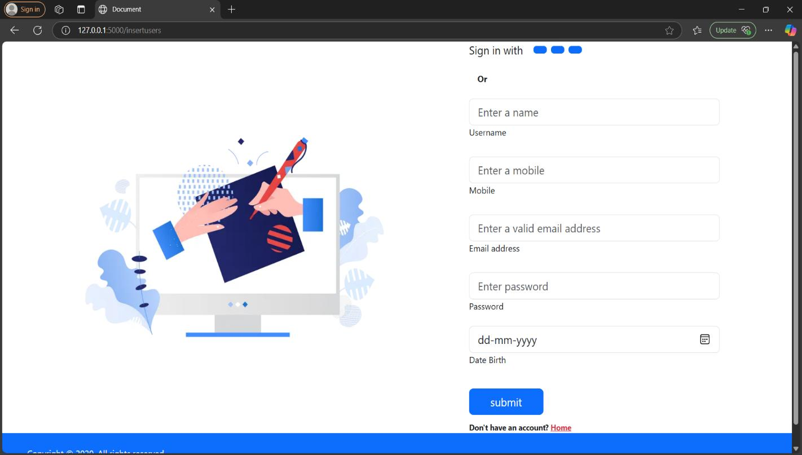
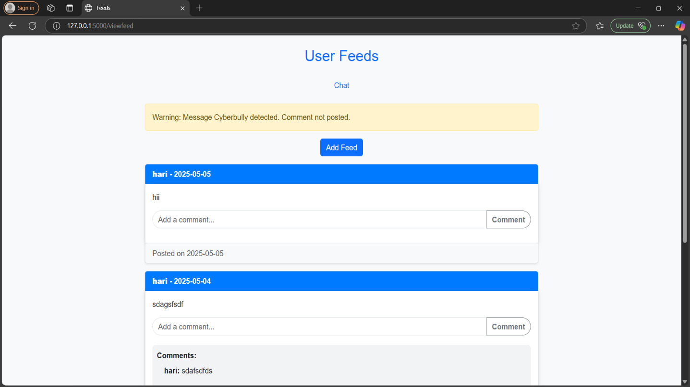

<div align="center">

# 🛡️ BERT-Based Cyberbullying Detection

### AI-Powered Cyberbullying Detection using BERT, OCR & Sentiment Analysis

A Flask-based web application that detects cyberbullying in text messages, images, and emoji-enhanced conversations using a fine-tuned **BERT (Bidirectional Encoder Representations from Transformers)** model.


</div>

---

## 🌐 Live Demo

🚀 Deployed Application:  
https://bert-based-cyberbullying-detection.onrender.com/

---

# 📖 Table of Contents

- About
- Features
- Project Architecture
- Workflow
- Technology Stack
- Project Structure
- Installation
- Running the Project
- Dataset
- Machine Learning Model
- Screenshots
- Future Enhancements

---

# 📌 About

Cyberbullying has become one of the major challenges across modern social media platforms. Harmful messages are no longer limited to plain text—they often include emojis, memes, screenshots, and indirect language that traditional detection systems struggle to identify.

This project introduces an **AI-powered Cyberbullying Detection System** capable of analyzing:

- 💬 Text messages
- 🖼 Images containing text (OCR)
- 😀 Emojis
- 😊 Sentiment

The system uses a **fine-tuned BERT model** to understand contextual meaning rather than relying only on keywords, making it significantly more effective in detecting sarcastic, indirect, and context-dependent bullying.

---

# ✨ Features

## User Features

- User Registration
- Secure Login
- Chat Interface
- Send Text Messages
- Upload Images
- View Chat History

## AI Features

- BERT-based Text Classification
- OCR using Pytesseract
- Emoji Detection
- Sentiment Analysis
- Harmful Message Prediction
- Real-time Detection

## System Features

- SQLite Database
- Flask Backend
- Responsive Web Interface
- Image Upload Support
- Prediction Storage

---

# 🏗 Project Architecture

```
                 User
                   │
                   ▼
          Flask Web Application
                   │
      ┌────────────┼────────────┐
      │            │            │
      ▼            ▼            ▼
  Text Input   Image Upload   Emojis
      │            │            │
      ▼            ▼            ▼
 BERT Model     OCR Module   Emoji Parser
      │            │            │
      └────────────┼────────────┘
                   ▼
          Sentiment Analysis
                   │
                   ▼
     Cyberbullying Prediction
                   │
                   ▼
           SQLite Database
```

---

# ⚙ Workflow

```
User Login
      │
      ▼
Open Chat Screen
      │
      ▼
Send Text / Upload Image
      │
      ▼
OCR (if image)
      │
      ▼
Emoji Extraction
      │
      ▼
Text Preprocessing
      │
      ▼
Fine-tuned BERT Model
      │
      ▼
Prediction
      │
      ▼
Bullying / Non-Bullying
      │
      ▼
Store Result
```

---

# 💻 Technology Stack

## Frontend

- HTML5
- CSS3
- JavaScript

## Backend

- Python
- Flask
- Flask-CORS

## Artificial Intelligence

- PyTorch
- HuggingFace Transformers
- BERT (bert-base-uncased)

## NLP

- NLTK
- VaderSentiment
- Emoji

## OCR

- Pytesseract

## Database

- SQLite

## Development

- VS Code
- Jupyter Notebook

---

# 📂 Project Structure

```
BERT-BASED-CYBERBULLYING-DETECTION
│
├── dataset
│   └── cyberbullying_tweets.csv
│
├── models
│   ├── model.pkl
│   ├── modelBert1.pth
│   └── vectorizer.pkl
│
├── notebooks
│   ├── Cyber Bullying Tweet Classification.ipynb
│   ├── detecting-bullying-tweets-pytorch-lstm-bert.ipynb
│   └── emoji.ipynb
│
├── database
│   └── chat.db
│
├── src
│   ├── main.py
│   ├── Prediction.py
│   └── db.py
│
├── static
│   ├── css
│   ├── js
│   └── images
│
├── templates
│   ├── index.html
│   ├── login.html
│   ├── reg.html
│   ├── chatscreen.html
│   └── feed.html
│
├── uploads
│
└── README.md
```

---

# 🚀 Installation

## Clone Repository

```bash
git clone https://github.com/yourusername/BERT-Based-Cyberbullying-Detection.git

cd BERT-Based-Cyberbullying-Detection
```

---

## Create Virtual Environment

```bash
python -m venv venv
```

Windows

```bash
venv\Scripts\activate
```

Linux / macOS

```bash
source venv/bin/activate
```

---

## Install Dependencies

```bash
pip install -r requirements.txt
```

---

## Download OCR

Install Tesseract OCR

Windows

https://github.com/UB-Mannheim/tesseract/wiki

Linux

```bash
sudo apt install tesseract-ocr
```

---

# ▶ Running the Project

```bash
cd src

python main.py
```

Open your browser

```
http://127.0.0.1:5000
```

---

# 📊 Dataset

**Dataset**

```
cyberbullying_tweets.csv
```

The dataset contains labelled tweets categorized into bullying and non-bullying classes and is used for training and evaluating the machine learning models.

---

# 🤖 Machine Learning Model

## Base Model

BERT (bert-base-uncased)

## Framework

PyTorch

## NLP Libraries

- Transformers
- NLTK
- VaderSentiment

## Additional Modules

- Emoji Detection
- OCR (Pytesseract)
- Text Cleaning
- Tokenization
- Sentiment Analysis

The model analyzes contextual meaning using bidirectional attention, enabling more accurate detection of sarcasm, indirect insults, and abusive language compared to traditional keyword-based approaches.

---

# 📸 Screenshots

## Screenshots

### Home Page


### Login Page


### Registration Page


### Cyberbullying Prediction Page


---

# 📈 Future Enhancements

- Real-time API deployment
- Multilingual cyberbullying detection
- Explainable AI predictions
- User reporting system
- Admin dashboard
- Docker support
- Cloud deployment
- Mobile application
- Transformer model optimization
- Real-time social media integration

---

# 👨‍💻 Authors

**Jeevitha D**
**Subashree J**
**Madhumitha K**

Artificial Intelligence & Machine Learning

BERT-Based Cyberbullying Detection using Deep Learning

---
